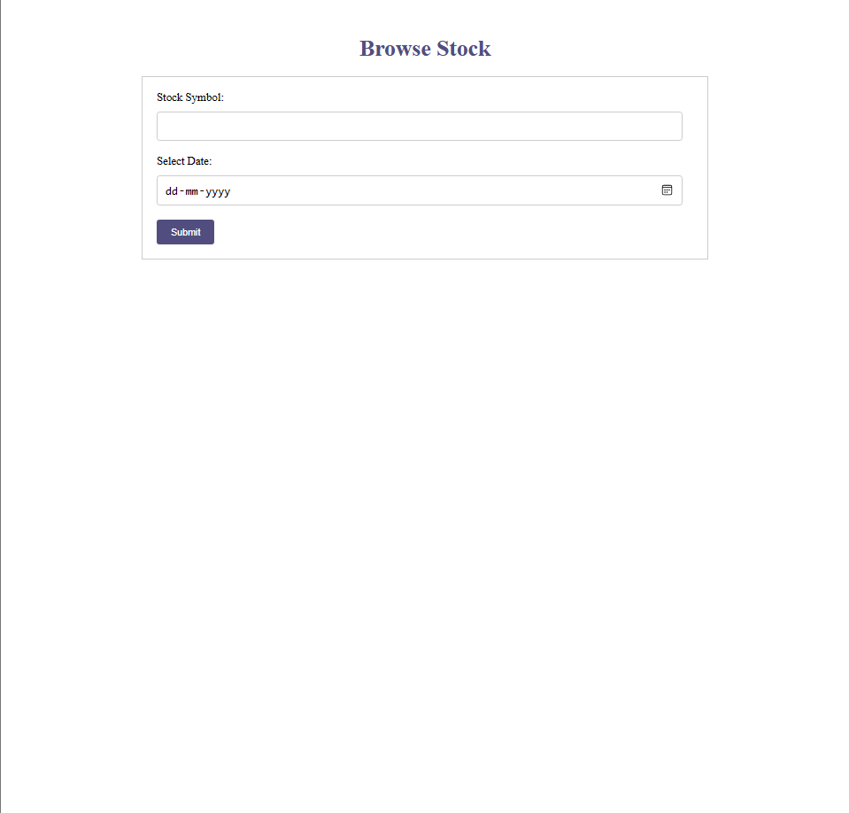
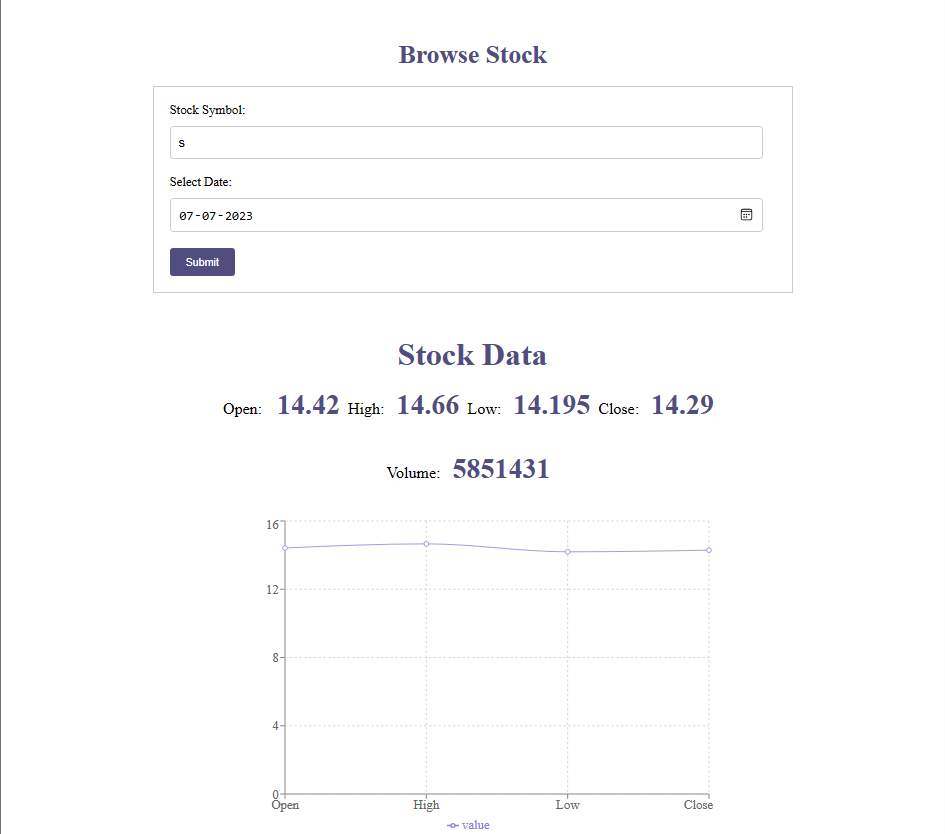

<h1 align="center">Browse Stock OHLCV</h1>

<p align="center">The application displays the Open, High, Low, Close and Volume values along with a line and bar graph visualization for a given stock symbol/ticker on a given date handling appropriate edge cases.</p>

## live: https://fuzail22.github.io/Browse_Stock_OHLCV



### Want to watch how it works?

[Ckick Here](https://www.loom.com/share/9a3deb318c1c42ca838f018a570002cf?sid=d5bfe72c-31ce-45f1-8def-d87078d88c65)



## Constraints

The application was designed based on following edge cases and constraints that I came up with.

## Edge cases checks on frontend before requesting

1. date range in picker to be restricted to last two years excluding current day as we only get the last 2 year's end of the day data for free version.
2. if user chooses saturdays and sundays display error and disable submit button as market is closed.
3. when some error occurs during fetch the user should know what happened in layman terms and should know whether to wait or proceed again, so display appropriate messages when error response from backend is recieved.
4. ondatachange clear screen of any error/previous output.
5. empty fields shouldn't be submitted make both input fields required.
6. Have necessary try and catch blocks when waiting for a response.

## Edge cases checks on backend before requesting/responding

1. convert stock symbol input to upper case before sending axios request as Polygon API recognizes only the uppercase form.
2. check if server response is ok.
3. if server response is ok then filter only the required fields from json object(Object destructuring is used) then send it to the frontend.
4. if server response is not ok get the status code, store the message/error and send it as response to the frontend.
5. Check if the stock symbol exists and then send request saving number of api calls(not able to complete because of the 5calls/min restriction - GetAllTIckets.js contains the code)
6. Have necessary try and catch blocks when waiting for a response.

## Components

> For the purpose of separation of concerns I have split the page into several components.

1. StockForm - To get the input values.
2. StockData - To display OHLCV values.
3. \*StockChart- To visualize the OHLC, neglecting the volume.

## API Responses

1. 403 we don't have access to that date.
2. 404 sunday or saturday or data not found due to some other reasons.
3. 429 5 calls/minute is utilized i.e., to many requests.
4. 200 response is ok.

## Feature Enhancement tasks

1. In order to improve the UX for a large user, we can have the following,
   1. load balancer such as Nginx to handle large incoming traffic.
   2. Design the UI to be responsive for all screen sizes(mobiles,Desktops, etc.,).
   3. Implement server-side caching to store frequently requested stock data.
   4. Utilize client-side caching to store data temporarily on the user's device.
   5. For charts and other data visualizations, we can have lazy loading.
   6. we can use CDN's to deliver static data fast.
   7. we can set up analytics and monitoring tools to track user behavior, identify bottlenecks, and gain insights to further improve the application's performance.
   8. we can add dark mode.
2. To Improve utility we can add new features such as,
   1. historical comparison with other stocks based on which the user can invest or sell.
   2. Price alerts where user can set a buy/sell price for a stock and recieve alerts when it drops below it.
   3. adding stock screener where user can filter based on yield or market cap
   4. add social sharing using which people can share interesting insights.
   5. create a user watchlist where users can watch they performance of favourite stocks like a feed without needing to search and understand.

<h1 align="center"> Learning and understanding React states,Hooks,events, event listners, event listner attributes, event handlers and functions used in this project. </h1>

## States

### searchResults

- searchResults is initially set to an empty array([]) using useState Hook.
- setSearchResults- is a function provided by useState Hook to update the searchResults value.
- findIndex is inbuilt method provided to arrays by javascript.

## References

### searchContainerRef

- Used to close the drop the dropdown when clicked outside of the container.

### selectedRef

- Used to scroll into view the current element selected using arrowKeys.

## Hooks

### useState

- To create a state variable and set the initial state.

### useRef

- To create a reference varibale which doesn't renrender dependent DOM elements and set the initial state.

### Effect Hook

    ```
    useEffect(()=>{
    const handleOutsideClick = (e) => {
       if (searchContainerRef.current && !searchContainerRef.current.contains(e.target)) {
        setShowDropdown(false);
      }
    };
    document.addEventListener("click", handleOutsideClick);
    return () => {
      document.removeEventListener("click", handleOutsideClick);
    };
    },[]);
    ```

- This gets triggered only once and as soon as the component is mounted, only once because the dependent array is empty.
- The content inside return gets executed when the component unmounts. In our case event listner is removed thereby avoiding memery leaks.
- `searchContainerRef.current` checks if searchContainerRef has the node element been set to it.
- `!searchContainerRef.current.contains(e.target)` checks if the element clicked is not inside the refered div element.

## Functions

### fetchSearchResults

- To get all relevant names of stocks, the name can be passed and retrieved in 2 ways,
  - Query
    - frontend: `axios.get(api/fetch/?name=${name})`
    - backend:
      ```
      app.get("api/fetch/",(response,request)=>{
        name=req.query.name
      })
      ```
  - Path:
    - frontend: axios.get(api/fetch/${name})
    - backend:
      ```
      app.get("api/fetch/:name",(response,request)=>{
        name=req.params.name
      })
      ```

## Events

In web Development an event is any action that happens in the browser or more specifically inside the DOM.

- example: mouse click, mouse hover, keyboard key press etc.

1. what is event listners?

   - In vanilla javascript (that is plain JS without any framworks) event listners are methods available for the objects we create for an HTML element.
     ```
     const btn = document.querySelector("button");
     ```
     > Here <stronger>btn</stronger> is the object created for the button element and these object contain methods called eventlistners to listen events (eg: mouseclick) which can be accessed as below.
     ```
     btn.addEventListner("click",
     ()=>{
     console.log("Button cLicked")
     })
     ```
     > There are 2 parameters to the addEventlistner method
     >
     > - First Parameter: The event(eg:click) itself.
     > - Second Parameter: The [callback function](https://developer.mozilla.org/en-US/docs/Glossary/Callback_function), which will be called when the event occurs.

2. What is event handlers properties?
   - In vanilla javascript event handler properties are properties available for the objects we create for an HTML element.
     ```
     const btn = document.querySelector("button");
     ```
     ```
     btn.onclick = ()=>{
     console.log("Button Clicked");
     }
     ```
3. what is event handler HTML attributes?

   - An event handler HTMl attribute is also called an inline event handler.
   - An event handler HTML attribute are provided by the HTMl itself and it can used as follows

   ```
   <!--HTML File-->

   <button onclick="eventHandlerFunc()">Click Me</button>
   ```

   ```
   <!--JS File-->

   function eventHandlerFunc(){
   console.log("Button Clicked");
   }
   ```

4. What is an event handler?

   - An event handler is a function that is called when a event is triggered and captured by either of the three(event listner, event handler property or event handler HTML attribute).
   - The above <Strong>eventHandlerFunc</Strong> function is an example of event handler.

5. Which one to use method, property or the attribute?
   - Usage of event listner is recommended over the other 2 for complex large scale projects.
   - Event listner has the ability to call more than one function for any given event whereas event handler property doesn't.
   - Event handler HTML attribute is age old offering and it's always good to seperate HTML from JS so avoid using this.
6. Why do we use event attribute in React if it's not best practise?
   - React takes care of it and converts this usage into event listerner.
   - A we use attribute in JSX which is not just plain HTML.
7. How to differentiate between an HTML event attribute vs react event attribute?
   - React event attributes are camel Cased(onClick) whereas HTML's are small case(onclick).

<h1 align=center> MONGOOSE ODM </h1>
<p align=center> Understanding Object data modelling </p>

## Commands

1. To Connect to mongo db using connection string
   ```
   mongoose.connect("mongodb://localhost:27017/<DB NAME>", {
   useNewUrlParser: true,
   useUnifiedTopology: true,
   });
   ```
2. To create a schema for the model
   ```
   const <SCHEMA NAME> = mongoose.Schema({
   key1: ValueDataType,
   key2: ValueDataType,
   keyn: ValueDataType
   });
   ```
3. To create a model for interacting with the DB
   ```
   const <MODEL REFERENCE NAME> = mongoose.model("<MODEL NAME>", <SCHEMA NAME>);
   ```
   > Note: The "MODEL NAME" mentioned here will be pluralized and if a collection doesn't exist in the same name a new
   > collection will be created on first insert.
4. Function to insert documents into the collection
   ```
   async function saveToDatabase(ObjectName) {
     try {
       await <MODEL REFERENCE NAME>.insertMany(ObjectName);
       console.log("Saved to the database.");
     } catch (error) {
       console.error("Error saving to the database:", error.message);
       throw error;
     }
   }
   ```
5. To insert documents,
   ```
   await saveToDatabase(ObjectName);
   ```
6. To search for documents,
   ```
   const results = await <MODEL REFERENCE NAME>.find({ <KEY>: <VALUE>  }).select("<KEY>");
   ```

## Reference

[Mongoose ODM Basics](https://www.mongodb.com/developer/languages/javascript/mongoose-versus-nodejs-driver/)

# Render
- To make auto deploy work for new commits install the app to your repository.
- click [here](https://github.com/apps/render) to install
- environment variable values must not be in double quotes.
- as this is a free deployment, server automatically spun down after 15 minutes of inactivity, therefore on first new requests to the server after inactivity there is a slight delay in response for both stock data and stock name search dropdownn
> The backend (server) is set to auto deploy (CD-continous deployment) when new changes are been commited to main branch.
> Exluding the changes made to getALLTickets, StoreAllTickets, searchServer.

# GitHub Pages
- The frontend is production built using ```npm run build``` and deployed using ```gh-pages -d build```

